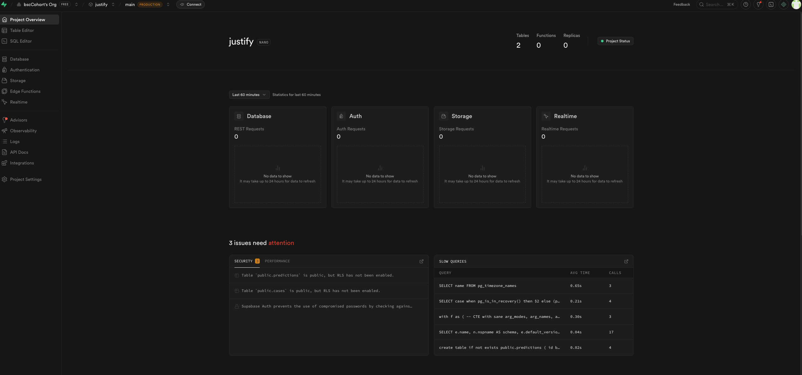
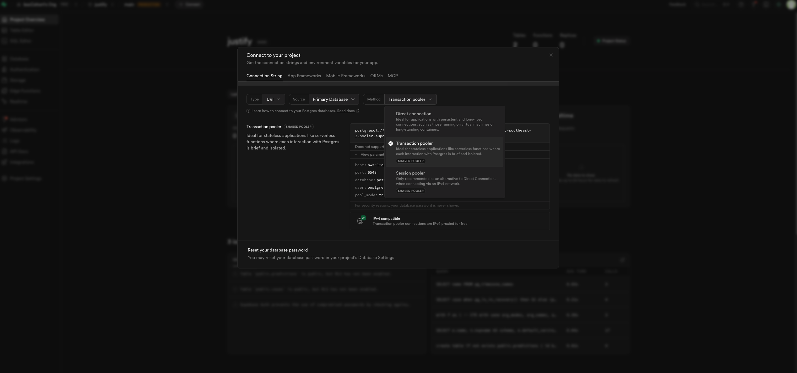
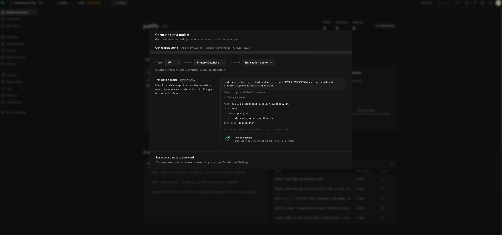

# justify

```shell
# Create the venv
python3 -m venv .venv

# Activate the venv
source .venv/bin/activate

# Upgrade pip to latest if required
python -m pip install --upgrade pip

# Install necessary modules from requiremetns file
python -m pip install -r requirements.txt

# Install necessary modules
pip install flask joblib scikit-learn python-dotenv psycopg[binary] flask_cors

# Fix interpreter issues if shows up
# For any linting errors by the IDE, choose an different interpreter option from the Fix menu and provide the current venv as an interpreter

# Freeze all the libraries with all their versions
pip freeze > requirements.txt
```


### Run the server

```
uvicorn app.main:app --reload
```

### Setup Database Credentials

- Collect the Supabase DB Creds from transaction pooler configurations



- Copy and paste all the credentials in the .env file, add this file in the .gitignore
- Make a copy of that file, give it a name .env.example, modify the credential values to dummy values, this file is fine to push to remote branch.

### Setup The API

- Test the ML model via API endpoint
```shell
curl -s -X POST http://127.0.0.1:5000/predict \
  -H "Content-Type: application/json" \
  -d '{"text":"Portugal crash out of FIFA World Cup, Ronaldo in tears"}'
```

- Test POST request
```shell
curl -s -X POST http://127.0.0.1:5000/cases \
  -H "Content-Type: application/json" \
  -d '{
    "title": "World Cup update",
    "case_text": "Portugal crash out of FIFA World Cup, Ronaldo in tears"
  }'
```

- Test Read All Objects
```shell
curl -s http://127.0.0.1:5000/cases
```
- Test One Object
```shell
curl -s http://127.0.0.1:5000/cases/1
```

- Update One Object

```shell
curl -s -X POST http://127.0.0.1:5000/cases \
  -H "Content-Type: application/json" \
  -d '{"title":"Test","case_text":"Apple launches new AI chip for laptops"}'
```

```shell
curl -s -X PUT http://127.0.0.1:5000/cases/2 \
  -H "Content-Type: application/json" \
  -d '{"status":"reviewing","notes":"Needs more details from client"}'
```

- Delete One Object
```shell
curl -s -X DELETE http://127.0.0.1:5000/cases/1
```

### Setup NextJS Project

```shell
cd frontend
npx create-next-app@latest .


(.venv) @bscCohort ➜ /workspaces/justify/frontend (main) $ npx create-next-app@latest .
Need to install the following packages:
create-next-app@16.1.1
Ok to proceed? (y) y
✔ Would you like to use the recommended Next.js defaults? › Yes, use recommended defaults
Creating a new Next.js app in /workspaces/justify/frontend.

Using npm.

Initializing project with template: app-tw 


Installing dependencies:
- next
- react
- react-dom

Installing devDependencies:
- @tailwindcss/postcss
- @types/node
- @types/react
- @types/react-dom
- eslint
- eslint-config-next
- tailwindcss
- typescript


added 363 packages, and audited 364 packages in 53s

145 packages are looking for funding
  run `npm fund` for details

found 0 vulnerabilities

Generating route types...
✓ Types generated successfully

Success! Created frontend at /workspaces/justify/frontend

npm notice 
npm notice New major version of npm available! 9.8.1 -> 11.7.0
npm notice Changelog: https://github.com/npm/cli/releases/tag/v11.7.0
npm notice Run npm install -g npm@11.7.0 to update!
npm notice 


(.venv) @bscCohort ➜ /workspaces/justify/frontend (main) $ npm install @supabase/supabase-js

added 10 packages, and audited 374 packages in 5s

145 packages are looking for funding
  run `npm fund` for details

found 0 vulnerabilities


(.venv) @bscCohort ➜ /workspaces/justify/frontend (main) $ npm install -D tailwindcss postcss autoprefixer
npx tailwindcss init -p

added 3 packages, and audited 377 packages in 1s

147 packages are looking for funding
  run `npm fund` for details

found 0 vulnerabilities

(.venv) @bscCohort ➜ /workspaces/justify/frontend (main) $ npm i react-hot-toast

added 2 packages, and audited 379 packages in 3s

147 packages are looking for funding
  run `npm fund` for details

found 0 vulnerabilities

```

- The data flow for frontend goes like this
```shell
routes (pages) → hooks (logic) → api (data access) → components (UI)
```

- To Run The Dev Server Of UI
```
npm run dev
```
- To Run The Prod Server Of UI
```
npm run start
```
- To Run The Servers In Phoenix Admin
```
NEXT_PUBLIC_ASSET_PREFIX=/proxy/3002 npm run dev -- -p 3002
```